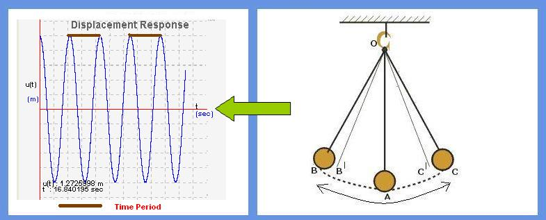

In this module, basic concepts of simple oscillator are explained. Initially, an example of simple pendulum is taken and the basic terminology i.e., what is initial displacement, initial velocity,natural frequency and time period are explained. Each of these terms is illustrated by giving an example, where user can enter his value and observe the behavior of structure for his input.

Simple harmonic oscillator consists of a mass (m) hanging from a string of length (l), fixed at a pivot point P. When the mass is displaced from its mean position by giving some initial displacement (angle), oscillator starts swinging back and forth with periodic motion.

Objective of simple harmonic oscillator experiment is to understand the concept of time period (natural frequency) in harmonic oscillations .

 
 
