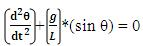
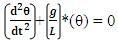
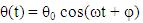

By applying Newton's second law for rotational systems, the equation of motion for the pendulum may be obtained.

Where, τ = Torque ; I = Moment of Inertia; α = Angular Velocity. m is mass of the oscillator, l is the length of the oscillator and theta is initial displacement. The above equation can be rearranged as -

 
 

If the amplitude of angular displacement is small then we can use the approximation (sinθ ≈ θ). By considering the above approximation, the equation of motion reduces to :

 

The solution for equation of simple harmonic oscillator is

 

where, θ(t) is the history of oscillation, θ0 is the initial angle, ω=(g/l)1/2
